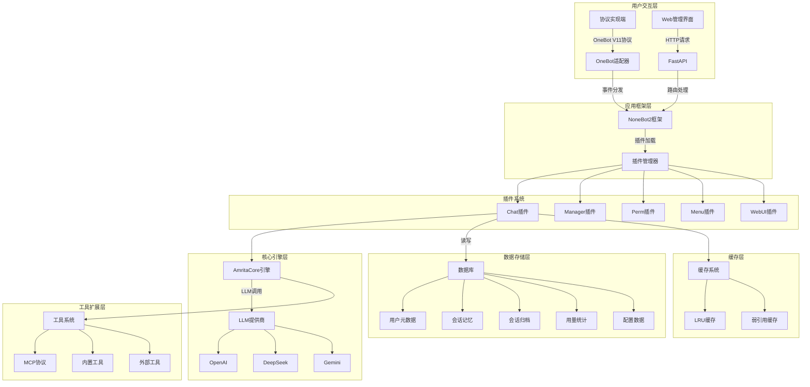
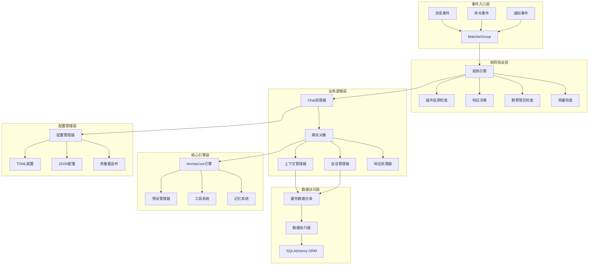
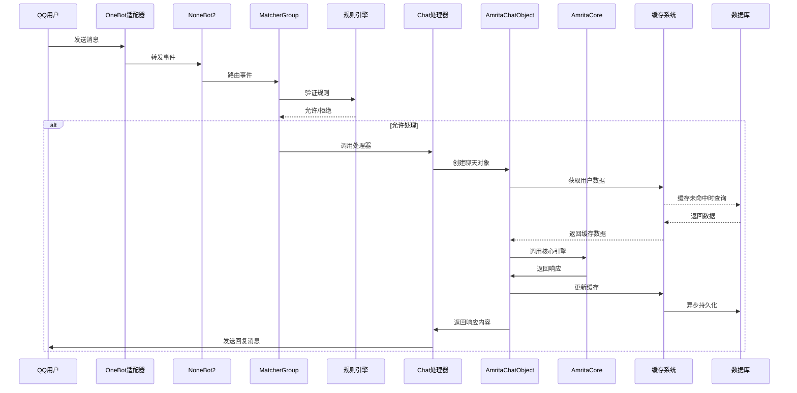
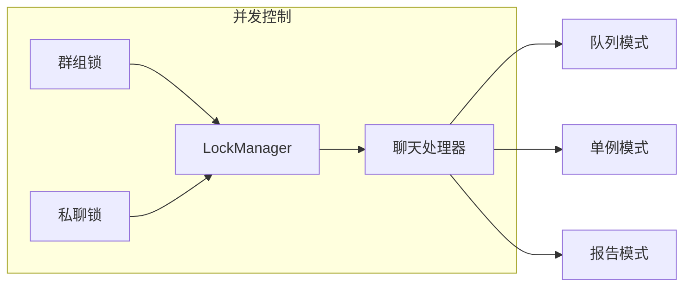
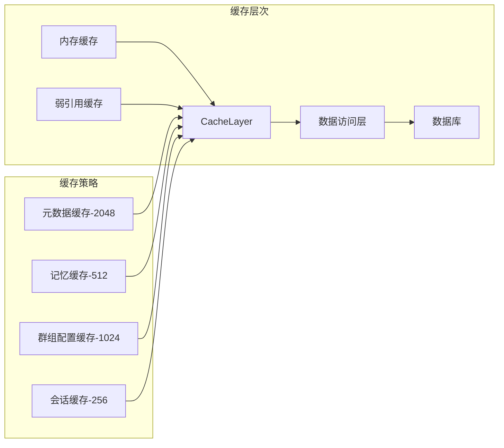

# Amrita 项目架构分析

## 1. 项目概述

`Amrita` 使用 `AmritaCore` 作为其核心引擎。`AmritaCore` 提供了基础的 LLM 集成、上下文管理和工具调用能力，而 `Amrita` 在此基础上构建了完整的 QQ 机器人应用，包括插件系统、权限管理、WebUI 等功能模块。

`Amrita` 与 `AmritaCore` 的关系类似于 Linux 发行版与 Linux 内核的关系：`AmritaCore` 作为Agent底层核心引擎提供基础能力，`Amrita` 作为上层应用框架提供完整的用户交互和管理功能。

## 2. 整体架构拓扑图

## 3. Chat插件详细架构

### 3.1 Chat插件核心组件拓扑图

### 3.2 数据流分析

## 4. 核心组件分析

### 4.1 运行时核心 (runtime.py)

**职责**：处理单次聊天会话的完整生命周期。

**核心组件**：

- **AmritaChatObject**：聊天处理对象，封装完整会话逻辑
- **ChatObjectMeta**：聊天对象元数据模型
- **SessionTempManager**：会话临时状态管理

**主要功能**：

- 会话超时管理
- 上下文恢复（"继续"功能）
- 异常处理和管理员通知
- 会话状态快照

### 4.2 事件路由系统 (matcher_manager.py)

**职责**：集中管理所有事件处理器和命令注册。

**事件类型**：

- **消息事件**：处理普通聊天消息
- **命令事件**：处理各种管理命令
- **通知事件**：处理戳一戳、撤回等通知

### 4.3 消息处理器 (handlers/chat.py)

**职责**：实现消息处理的核心业务逻辑。

**处理流程**：

1. 消息预处理（合成消息内容，处理引用）
2. 上下文管理（获取和更新会话上下文）
3. 模型调用（调用AmritaCore进行LLM推理）
4. 响应后处理（格式化和发送响应消息）

### 4.4 数据访问层 (utils/sql.py + utils/app.py)

**数据库模型**：

- **UserMetadata**：用户元数据（用量统计、活跃时间）
- **Memory**：会话记忆数据（聊天历史）
- **MemorySessions**：会话归档（超时会话保存）
- **InsightsModel**：全局用量统计

**缓存机制**：

- **LRUCache**：基于最近最少使用策略的缓存
- **WeakValueLRUCache**：弱引用缓存
- **脏数据标记**：自动跟踪数据修改状态
- **细粒度锁**：确保并发安全

### 4.5 规则引擎 (check_rule.py)

**职责**：决定是否响应特定消息事件。

**决策逻辑**：

- 插件状态检查
- 权限验证
- 用量限制检查
- 自动回复触发条件判断

## 5. 技术特性

### 5.1 并发控制机制

### 5.2 缓存架构

### 5.3 上下文管理策略

**上下文长度控制**：

- 消息数量限制（默认50条消息）
- Token窗口限制（可配置）
- 自动摘要（超出限制时生成上下文摘要）
- 会话归档（超时会话自动归档保存）

**上下文优化**：

- 最小上下文模式
- 多模态上下文支持
- 引用上下文处理

## 6. 扩展机制

### 6.1 钩子系统

**预完成钩子** (`on_precompletion`)：

- 在LLM调用前执行自定义逻辑
- 支持优先级排序
- 可修改输入上下文

**工具注册** (`on_tools`)：

- 注册自定义工具函数
- 支持条件启用
- 集成到Agent工作流

### 6.2 WebUI集成

**管理界面功能**：

- 模型预设管理
- 提示词模板编辑
- 用量统计查看
- 会话状态监控
