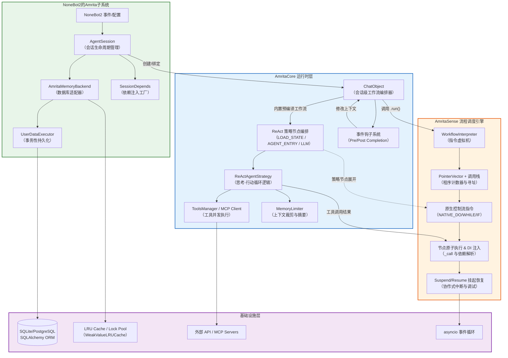
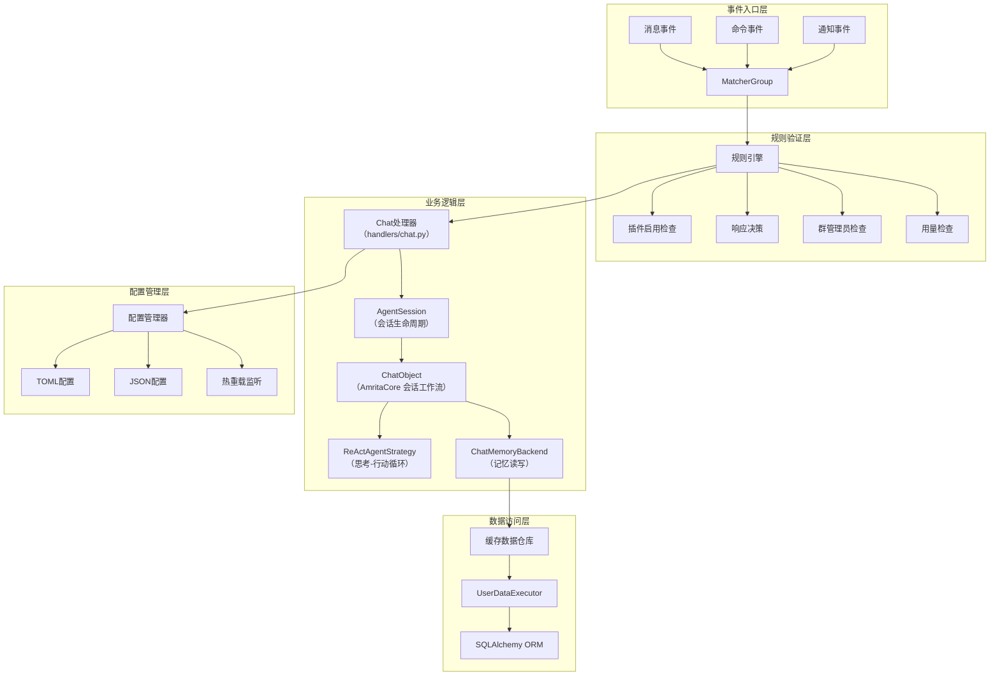
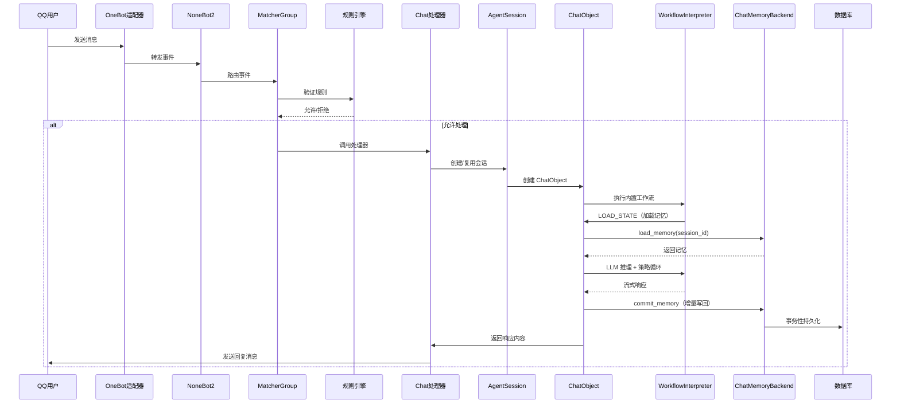
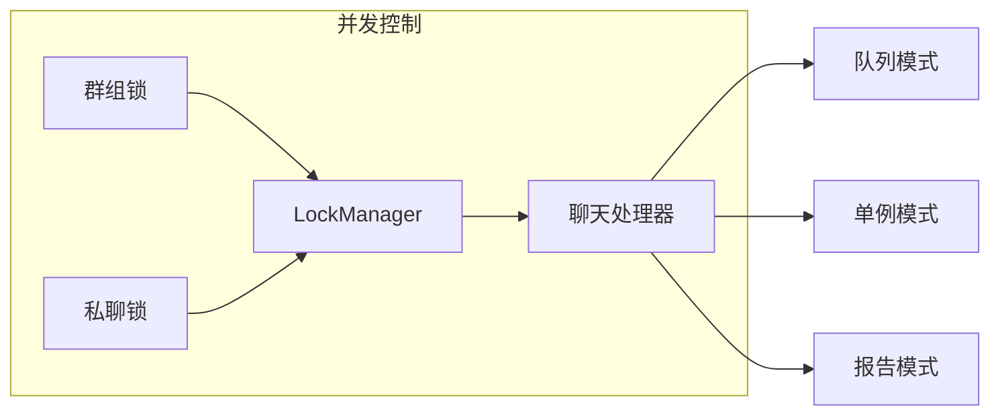
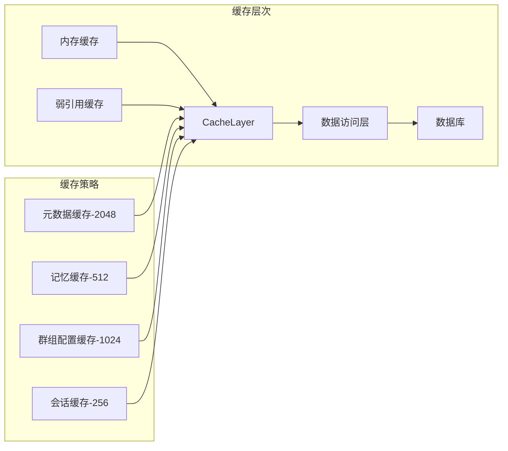

# AmritaBot 项目架构分析

## 1. 项目概述

AmritaBot 的技术栈分为四层：

- **AmritaBot 应用层（NoneBot2 的 Amrita 子系统）** — 终端应用层。集成 NoneBot2 + OneBot V11 适配器 + WebUI + 插件系统，通过 `AgentSession` 管理会话生命周期、`AmritaMemoryBackend` 对接数据库持久化、`SessionDepends` 提供依赖注入工厂。
- **AmritaCore** — Agent 运行时层。构建于 AmritaSense 之上，提供会话级工作流编排器（`ChatObject`）、策略节点编排（`LOAD_STATE` / `AGENT_ENTRY` / `LLM`）、ReAct 思考-行动循环（`ReActAgentStrategy`）、厂商无关的适配器系统（OpenAI / Anthropic / 可扩展）、工具系统（`ToolsManager` / MCP 客户端）、上下文裁剪与摘要（`MemoryLimiter`）以及事件钩子（Pre/Post Completion）。
- **AmritaSense** — 底层工作流编排引擎。采用**指令集架构**替代传统图模型，将控制流（IF/WHILE/GOTO/CALL/TRY）编译为线性指令序列，由轻量 VM（`WorkflowInterpreter` + `PointerVector` + 调用栈）逐条执行。核心约 300 LOC，支持原生异步挂起/恢复。

四者的关系类似于：**AmritaSense = 操作系统内核 → AmritaCore = 中间件/运行时 → AmritaBot = 桌面环境/应用**。

## 2. 整体架构拓扑图

```mermaid
graph TD
    %% 定义样式
    classDef plugin fill:#e8f5e9,stroke:#2e7d32,stroke-width:2px;
    classDef core fill:#e3f2fd,stroke:#1565c0,stroke-width:2px;
    classDef sense fill:#fff3e0,stroke:#e65100,stroke-width:2px;
    classDef infra fill:#f3e5f5,stroke:#7b1fa2,stroke-width:2px;

    %% 1. 应用与插件接入层 (Plugin/Adapter Layer)
    subgraph Application_Plugin_Layer [NoneBot2的Amrita子系统]
        direction TB
        A[NoneBot2 事件/配置] --> B[AgentSession<br>（会话生命周期管理）]
        B --> C[AmritaMemoryBackend<br>（数据库适配器）]
        C --> D[UserDataExecutor<br>（事务性持久化）]
        B --> E[SessionDepends<br>（依赖注入工厂）]
    end

    %% 2. AmritaCore 运行时层 (Agent Runtime Layer)
    subgraph Core_Runtime_Layer [AmritaCore 运行时层]
        direction TB
        B -- 创建/绑定 --> F[ChatObject<br>（会话级工作流编排器）]
        F -- 内置预编译工作流 --> G[ReAct 策略节点编排<br>（LOAD_STATE / AGENT_ENTRY / LLM）]
        G --> H[ReActAgentStrategy<br>（思考-行动循环逻辑）]
        H --> I[ToolsManager / MCP Client<br>（工具并发执行）]
        H --> J[MemoryLimiter<br>（上下文裁剪与摘要）]
        F --> K[事件钩子系统<br>（Pre/Post Completion）]
    end

    %% 3. AmritaSense 流程调度层 (Meta-Framework Layer)
    subgraph Sense_Orchestration_Layer [AmritaSense 流程调度引擎]
        direction TB
        F -- 调用 .run() --> L[WorkflowInterpreter<br>（指令虚拟机）]
        L --> M[PointerVector + 调用栈<br>（程序计数器与寻址）]
        M --> N[原生控制流指令<br>（NATIVE_DO/WHILE/IF）]
        N --> O[节点原子执行 & DI 注入<br>（_call 与依赖解析）]
        O --> P[Suspend/Resume 挂起恢复<br>（协作式中断与调试）]
    end

    %% 4. 基础设施层 (Infrastructure Layer)
    subgraph Infrastructure_Layer [基础设施层]
        direction TB
        D --> Q[(SQLite/PostgreSQL<br>SQLAlchemy ORM)]
        C --> R[LRU Cache / Lock Pool<br>（WeakValueLRUCache）]
        I --> S[外部 API / MCP Servers]
        P --> T[asyncio 事件循环]
    end

    %% 跨层连接
    G -.->|策略节点展开| N
    H -- 工具调用结果 --> O
    K -- 修改上下文 --> F

    %% 样式应用
    class Application_Plugin_Layer plugin;
    class Core_Runtime_Layer core;
    class Sense_Orchestration_Layer sense;
    class Infrastructure_Layer infra;
```

> **架构要点**：
>
> - `AgentSession`（`nonebot_plugin_amrita.agent`）是应用层会话入口，负责会话生命周期（创建/加载/销毁），并注入 `SessionDepends` 供各插件按依赖获取会话
> - `ChatObject`（`amrita_core.chatmanager`）是会话级工作流编排器：将内置的预编译工作流（`REACT_ONLY = LOAD_STATE >> JINJA2_RENDER >> BUILD_MESSAGE >> REACT_BLOCK`、`STEP_REACT_ONLY` 等，见 `builtins/workflows.py`）交给 `WorkflowInterpreter` 执行
> - `AGENT_ENTRY` 节点将控制权交给 `ReActAgentStrategy`，策略通过 `tools_caller` 并发执行工具（`ToolsManager` / MCP Client），并用 `MemoryLimiter` 控制上下文窗口
> - 记忆的读写由 `LOAD_STATE` / `COMMIT_MEMORY` 节点触发应用层 `AmritaMemoryBackend`（或同构的 `ChatMemoryBackend`），经 `CachedUserDataRepository` → `UserDataExecutor` 事务性落库
> - 缓存层使用 `WeakValueLRUCache`（弱引用 + LRU），权限 / 管理模块用其实现细粒度锁池（`_lock_pool`）

## 3. Chat插件详细架构

### 3.1 Chat插件核心组件拓扑图

```mermaid
graph TD
    subgraph "事件入口层"
        MessageEvent[消息事件] --> MatcherGroup[MatcherGroup]
        CommandEvent[命令事件] --> MatcherGroup
        NoticeEvent[通知事件] --> MatcherGroup
    end

    subgraph "规则验证层"
        MatcherGroup --> RuleEngine[规则引擎]
        RuleEngine --> is_bot_enabled[插件启用检查]
        RuleEngine --> should_respond[响应决策]
        RuleEngine --> is_group_admin[群管理员检查]
        RuleEngine --> usage_check[用量检查]
    end

    subgraph "业务逻辑层"
        RuleEngine --> ChatHandler[Chat处理器<br>（handlers/chat.py）]
        ChatHandler --> AgentSession[AgentSession<br>（会话生命周期）]
        AgentSession --> ChatObject[ChatObject<br>（AmritaCore 会话工作流）]
        ChatObject --> Strategy[ReActAgentStrategy<br>（思考-行动循环）]
        ChatObject --> MemoryBackend[ChatMemoryBackend<br>（记忆读写）]
    end

    subgraph "数据访问层"
        MemoryBackend --> CachedUserDataRepository[缓存数据仓库]
        CachedUserDataRepository --> UserDataExecutor[UserDataExecutor]
        UserDataExecutor --> Database[SQLAlchemy ORM]
    end

    subgraph "配置管理层"
        ChatHandler --> ConfigManager[配置管理器]
        ConfigManager --> TOMLConfig[TOML配置]
        ConfigManager --> JSONConfig[JSON配置]
        ConfigManager --> HotReload[热重载监听]
    end
```

### 3.2 数据流分析

```mermaid
sequenceDiagram
    participant User as QQ用户
    participant Adapter as OneBot适配器
    participant NoneBot as NoneBot2
    participant Matcher as MatcherGroup
    participant Rule as 规则引擎
    participant Chat as Chat处理器
    participant Session as AgentSession
    participant Object as ChatObject
    participant WF as WorkflowInterpreter
    participant Backend as ChatMemoryBackend
    participant DB as 数据库

    User->>Adapter: 发送消息
    Adapter->>NoneBot: 转发事件
    NoneBot->>Matcher: 路由事件
    Matcher->>Rule: 验证规则
    Rule-->>Matcher: 允许/拒绝
    alt 允许处理
        Matcher->>Chat: 调用处理器
        Chat->>Session: 创建/复用会话
        Session->>Object: 创建 ChatObject
        Object->>WF: 执行内置工作流
        WF->>Object: LOAD_STATE（加载记忆）
        Object->>Backend: load_memory(session_id)
        Backend-->>Object: 返回记忆
        Object->>WF: LLM 推理 + 策略循环
        WF-->>Object: 流式响应
        Object->>Backend: commit_memory（增量写回）
        Backend->>DB: 事务性持久化
        Object->>Chat: 返回响应内容
        Chat->>User: 发送回复消息
    end
```

## 4. 核心组件分析

### 4.1 运行时核心 (chatmanager + runtime_session)

**职责**：处理单次聊天会话的完整生命周期。

**核心组件**：

- **ChatObject**（`amrita_core.chatmanager.chat_object`）：会话级工作流编排器，绑定预设、记忆后端与策略，调用 `WorkflowInterpreter` 执行内置工作流
- **SessionTempManager**（`amrita/plugins/chat/runtime_session.py`）：会话临时状态管理（`chat_manager` 单例）
- **AgentSession**（`nonebot_plugin_amrita.agent`）：应用层会话生命周期管理（创建/加载/销毁）

**主要功能**：

- 会话超时管理（`session.session_control`）
- 上下文恢复（"继续"功能）
- 异常处理和管理员通知
- 会话状态快照

### 4.2 事件路由系统 (matcher_manager.py)

**职责**：集中管理所有事件处理器和命令注册。

**事件类型**：

- **消息事件**：处理普通聊天消息
- **命令事件**：处理各种管理命令
- **通知事件**：处理戳一戳、撤回等通知

### 4.3 消息处理器 (handlers/chat.py)

**职责**：实现消息处理的核心业务逻辑。

**处理流程**：

1. 消息预处理（合成消息内容，处理引用）
2. 上下文管理（获取和更新会话上下文）
3. 模型调用（调用AmritaCore进行LLM推理）
4. 响应后处理（格式化和发送响应消息）

### 4.4 数据访问层 (utils/sql.py + utils/app.py)

**数据库模型**：

- **UserMetadata**：用户元数据（用量统计、活跃时间）
- **Memory**：会话记忆数据（聊天历史）
- **MemorySessions**：会话归档（超时会话保存）
- **InsightsModel**：全局用量统计

**缓存机制**：

- **LRUCache**：基于最近最少使用策略的缓存
- **WeakValueLRUCache**：弱引用缓存
- **脏数据标记**：自动跟踪数据修改状态
- **细粒度锁**：确保并发安全

### 4.5 规则引擎 (check_rule.py)

**职责**：决定是否响应特定消息事件。

**决策逻辑**：

- 插件状态检查
- 权限验证
- 用量限制检查
- 自动回复触发条件判断

## 5. 技术特性

### 5.1 并发控制机制

```mermaid
graph LR
    subgraph "并发控制"
        GroupLock[群组锁] --> LockManager
        PrivateLock[私聊锁] --> LockManager
        LockManager --> ChatProcessor[聊天处理器]
    end

    ChatProcessor --> QueueMode[队列模式]
    ChatProcessor --> SingleMode[单例模式]
    ChatProcessor --> ReportMode[报告模式]
```

### 5.2 缓存架构

```mermaid
graph LR
    subgraph "缓存层次"
        L1[内存缓存] --> CacheLayer
        L2[弱引用缓存] --> CacheLayer
        CacheLayer --> DataAccess[数据访问层]
        DataAccess --> Database[数据库]
    end

    subgraph "缓存策略"
        MetadataCache[元数据缓存-2048] --> CacheLayer
        MemoryCache[记忆缓存-512] --> CacheLayer
        GroupConfigCache[群组配置缓存-1024] --> CacheLayer
        SessionsCache[会话缓存-256] --> CacheLayer
    end
```

### 5.3 上下文管理策略

**上下文长度控制**：

- 消息数量限制（默认50条消息）
- Token窗口限制（可配置）
- 自动摘要（超出限制时生成上下文摘要）
- 会话归档（超时会话自动归档保存）

**上下文优化**：

- 最小上下文模式
- 多模态上下文支持
- 引用上下文处理

## 6. 扩展机制

### 6.1 钩子系统

钩子系统由 `amrita_core.hook` 提供，基于 AmritaSense 的事件总线（`on_event`），支持优先级排序与 `block` 阻断：

**预完成钩子** (`on_precompletion` → `PreCompletionEvent`)：

- 在LLM调用前执行自定义逻辑（`EventTypeEnum.BEFORE_COMPLETION`）
- 支持优先级排序
- 可修改输入上下文

**完成钩子** (`on_completion` → `CompletionEvent`)：

- 在LLM调用完成后执行自定义逻辑（`EventTypeEnum.COMPLETION`）
- 可读取/修改最终输出
- 支持优先级排序与阻断

**预设回退钩子** (`on_preset_fallback` → `FallbackContext`)：

- 预设缺失/回退时触发（`EventTypeEnum.PRESET_FALLBACK`）

**工具注册** (`on_tools`)：

- 注册自定义工具函数
- 支持条件启用
- 集成到Agent工作流

### 6.2 WebUI集成

**管理界面功能**：

- 模型预设管理
- 提示词模板编辑
- 用量统计查看
- 会话状态监控
