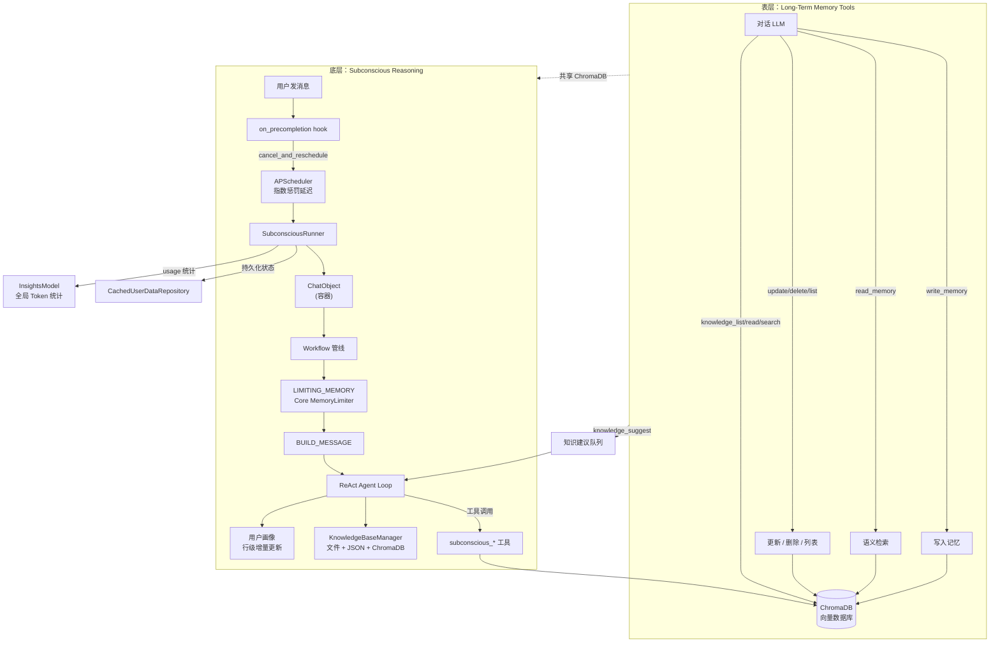
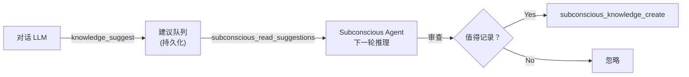
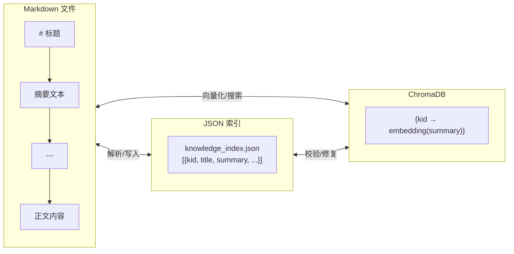

# 长期记忆与知识库

## 概述

长期记忆由 **`amrita_plugin_memory`** 插件提供（v0.3.1），是基于向量数据库（ChromaDB）与 Loop Engineering 的长期记忆与知识库插件。它采用**双层架构**：表层 Function Calling 记忆工具 + 底层事件驱动潜意识推理。

- **表层** — LLM 在对话中按需调用记忆工具（读写删改列），ChromaDB 语义检索。
- **底层** — 用户发消息时触发后台 Agent 整理记忆库，基于 Core Agent 框架复用 `ChatObject` 管线。

## 安装

```bash
uv run ambot plugin add amrita_plugin_memory
```

前置依赖：Python 3.10+ / AmritaBot 实例 / Ollama 或 OpenAI 嵌入服务 / ChromaDB。

安装后插件会自动注册到 `pyproject.toml` 的 `[tool.amrita.plugins]` 列表：

```toml
[tool.amrita]
plugins = ["amrita.plugin.chat", "amrita_plugin_memory"]
```

## 快速开始

### 1. 配置环境变量（`.env`）

```env
VECTOR_DB_TYPE=local
EMBEDDING_MODEL_URL=http://127.0.0.1:11434
EMBEDDING_MODEL_NAME=auto
EMBEDDING_PROCTOL=ollama-embed
```

| 环境变量                  | 默认值                   | 说明                                           |
| ------------------------- | ------------------------ | ---------------------------------------------- |
| `VECTOR_DB_TYPE`          | `local`                  | ChromaDB 类型：`local` / `remote`              |
| `VECTOR_DB_SERVER`        | `127.0.0.1`              | 远程 ChromaDB 地址（仅 `remote` 生效）         |
| `VECTOR_DB_PORT`          | `8000`                   | 远程 ChromaDB 端口（仅 `remote` 生效）         |
| `VECTOR_DB_SERVER_SSL`    | `false`                  | 远程 ChromaDB 是否使用 SSL（仅 `remote` 生效） |
| `EMBEDDING_MODEL_URL`     | `http://127.0.0.1:11434` | Embedding 模型地址                             |
| `EMBEDDING_MODEL_NAME`    | `auto`                   | Embedding 模型名称                             |
| `EMBEDDING_PROCTOL`       | `ollama-embed`           | Embedding 协议：`openai` / `ollama-embed`      |
| `EMBEDDING_MODEL_API_KEY` | 空                       | Embedding 模型 API 密钥（可选）                |

### 2. 开启表层记忆

表层记忆**开箱即用**，无需额外配置。LLM 会在需要时自动调用 `write_memory` / `read_memory` 等工具。

### 3. 开启潜意识推理（可选）

编辑 `config/amrita_plugin_memory/config.toml`：

```toml
[subconscious]
enabled = true
target_user_id = "你的QQ号"
```

设置 `target_user_id` 为目标用户的 QQ 号，重启 Bot 即可。用户每次发消息后，后台 Agent 会在 30 分钟后自动整理记忆库。

> **适用场景**：潜意识推理专为**个人助理**场景设计——单个 Bot 服务单个用户。它会在后台持续调用 LLM 进行记忆整理，**每轮推理可能消耗数万 tokens**。如果 Bot 服务于大量用户或对 token 成本敏感，建议保持 `enabled = false`。

如需允许 Agent 主动给用户发私聊消息，额外开启：

```toml
allow_send_to_user = true
```

如需关闭全局知识库以节省 token：

```toml
enable_knowledge = false
```

> 知识库依赖潜意识推理——当 `enabled = false` 时，知识库也会自动禁用。

### 4. 验证

观察日志中 `[Subconscious]` 前缀的输出：

```text
[Subconscious] Starting for user=你的QQ号
[Subconscious] Idle — waiting for user chat to trigger first run
```

用户发消息后约 30 分钟，会看到 `Cycle #1` 开始执行。

## 双层架构



## 功能

### 表层：长期记忆

| 功能     | 说明                                           |
| -------- | ---------------------------------------------- |
| 语义检索 | ChromaDB 嵌入向量相似度搜索                    |
| 分区隔离 | `scope="user"` 个人 / `scope="group"` 群共享   |
| 重要性   | low / medium / high 三级，支持过滤             |
| 标签分类 | 自定义标签（preference、project、personal 等） |
| 过期清理 | 短期 7 天 / 长期 90 天                         |
| 并发安全 | 用户 ID 粒度 `aiologic.Lock`                   |

### 底层：潜意识推理

| 功能         | 说明                                                      |
| ------------ | --------------------------------------------------------- |
| 事件驱动     | 用户发消息触发，无活动则永远空闲                          |
| 惩罚退避     | 连续触发时指数延长延迟（30min→45min→...→1440min）         |
| 自动整理     | LLM 后台去重、合并、标签补全、低质清理                    |
| 记忆压缩     | Core `MemoryLimiter` 截断超限 + 自动摘要                  |
| 去重辅助     | `subconscious_duplicate_helper` 返回待整理记忆 + 合并指导 |
| 统计概览     | `subconscious_get_memory_stats` 总量/重要性/标签分布      |
| 膨胀感知     | ChromaDB 超 `memory_warn_threshold` 时注入压缩提示        |
| 滑动窗口     | `max_abstracts` 轮摘要保留，跨轮传递进度                  |
| 用户画像     | 行级增量更新，Markdown 文件持久化                         |
| Session 摘要 | MemoryLimiter 全量摘要 + LRU 缓存                         |
| 主动消息     | LLM 向用户发起主动问候（需 `allow_send_to_user`）         |
| Token 统计   | 复用 Bot `InsightsModel` 全局统计                         |

### 共享：全局知识库

知识库是**表层和潜意识双层共享**的资源。读取操作（`list`/`read`/`search`）通过双重 `@on_tools` 注册，对话 LLM 和后台 Agent 均可直接调用。**写入操作**（`create`/`update`/`delete`）仅限潜意识 Agent——表层通过 `knowledge_suggest` 提交建议，由 Agent 在下一轮推理中审查后决定是否实际写入：



每条知识由三个组件共同管理：



**文件格式**：第一行 `# 标题`，然后摘要文本，`---` 之后是正文。框架自动管理分割——LLM 只需传 `title`/`summary`/`body` 三个字段，无需手动处理 `---`。摘要被向量化存入 ChromaDB 用于语义搜索，正文存在文件中支持按行分段读取。

**启动自修复**（`validate_on_startup`）：启动时计算三方 ID 集合的差集，自动修复四种不一致：

| 场景     | 检测                         | 修复                        |
| -------- | ---------------------------- | --------------------------- |
| 孤文件   | 文件在，JSON 索引无          | 解析文件追加到索引 + 向量化 |
| 孤索引   | JSON 在，文件无              | 从索引中删除 + 清理向量     |
| 缺向量   | JSON+文件都在，ChromaDB 缺失 | 从摘要重新向量化写入        |
| 悬空向量 | 向量在，JSON 索引无          | 从 ChromaDB 删除            |

**行级读取**：`knowledge_read` 支持 `start_line`/`end_line` 参数——LLM 可以用滑动窗口分段读取长知识，避免一次加载超长内容。`knowledge_search` 只匹配摘要向量，找到相关条目后再用 `knowledge_read` 按需拉取正文。

## 工具参考

### 表层工具

| 工具                | 参数                                         |
| ------------------- | -------------------------------------------- |
| `write_memory`      | content, tags, importance(enum), scope(enum) |
| `read_memory`       | query, top_k(5), importance?, scope(enum)    |
| `update_memory`     | id, scope, content?, tags?, importance?      |
| `delete_memory`     | id, scope                                    |
| `list_memory`       | limit, scope                                 |
| `knowledge_list`    | —                                            |
| `knowledge_read`    | kid, start_line?, end_line?                  |
| `knowledge_search`  | query, top_k?                                |
| `knowledge_suggest` | action, title, summary, body, reason         |

**scope 分区**：

- `scope="user"`：用户专属记忆，返回 `user_{user_id}` 分区（群聊私聊互通）
- `scope="group"`：群共享记忆，返回 `group_{group_id}` 分区（仅群聊可用）

### 潜意识工具（`rethinking/tools.py`）

记忆和 session/画像工具注册在隔离的 `_SUBCONSCIOUS_TOOLS` 上。知识库中 `list`/`read`/`search` 通过双重注册同时暴露给表层和潜意识；`create`/`update`/`delete` 仅潜意识可用（表层通过 `knowledge_suggest` 提交建议）：

| 工具                             | 用途                                   |
| -------------------------------- | -------------------------------------- |
| `subconscious_read_memory`       | 语义检索                               |
| `subconscious_write_memory`      | 写入新记忆                             |
| `subconscious_update_memory`     | 更新指定 ID 记忆                       |
| `subconscious_delete_memory`     | 删除指定 ID 记忆                       |
| `subconscious_list_memory`       | 列出全部记忆                           |
| `subconscious_iter_stop`         | 结束本轮推理                           |
| `subconscious_send_to_user`      | 主动向用户发消息                       |
| `subconscious_read_chat_context` | 读取最近聊天记录                       |
| `subconscious_duplicate_helper`  | 去重辅助（返回记忆 + 合并指导 prompt） |
| `subconscious_get_memory_stats`  | 记忆统计（总量/重要性/标签分布）       |
| `subconscious_knowledge_create`  | 创建知识条目                           |
| `subconscious_knowledge_update`  | 更新知识条目                           |
| `subconscious_knowledge_delete`  | 删除知识条目                           |
| `subconscious_knowledge_search`  | 语义搜索知识                           |

## 配置参考

编辑 `config/amrita_plugin_memory/config.toml`：

```toml
short_term_expiry_days = 7
long_term_expiry_days = 90
per_session_memory_limit = 50

[subconscious]
enabled = false
target_user_id = ""
allowed_tools = []
max_iterations = 10
loop_detect_threshold = 3
rethink_base_delay_minutes = 30
rethink_penalty_multiplier = 1.5
rethink_max_delay_minutes = 1440
prompt_file = "prompt/subconscious_main.md.jinja2"
prompt_send_file = "prompt/subconscious_send.md.jinja2"
prompt_knowledge_file = "prompt/knowledge_guide.md.jinja2"
prompt_profile_file = "prompt/profile_guide.md.jinja2"
enable_memory_compress = true
allow_send_to_user = false
memory_warn_threshold = 100
max_abstracts = 5
knowledge_max_chars = 10000
knowledge_collection_name = "amrita_global_knowledge"
enable_knowledge = true
```

| 配置项                                    | 默认值  | 说明                                             |
| ----------------------------------------- | ------- | ------------------------------------------------ |
| `short_term_expiry_days`                  | `7`     | 短期记忆过期天数                                 |
| `long_term_expiry_days`                   | `90`    | 长期记忆过期天数                                 |
| `per_session_memory_limit`                | `50`    | 每个会话的记忆数量限制                           |
| `subconscious.enabled`                    | `false` | 是否启用潜意识推理循环                           |
| `subconscious.target_user_id`             | `""`    | 目标用户 ID（MVP 仅支持单用户），为空则不启动    |
| `subconscious.max_iterations`             | `10`    | 单次推理最大 ReAct 循环步数（1-50）              |
| `subconscious.loop_detect_threshold`      | `3`     | 连续相同工具调用次数阈值（2-10），触发后注入提示 |
| `subconscious.rethink_base_delay_minutes` | `30`    | 用户聊天后首次计划延迟（分钟）                   |
| `subconscious.rethink_penalty_multiplier` | `1.5`   | 取消惩罚指数倍率（1.0-10.0）                     |
| `subconscious.rethink_max_delay_minutes`  | `1440`  | 惩罚延迟上限（分钟，默认 1 天）                  |
| `subconscious.enable_memory_compress`     | `true`  | 每次运行后压缩持久化摘要                         |
| `subconscious.allow_send_to_user`         | `false` | 允许潜意识主动向用户发消息                       |
| `subconscious.memory_warn_threshold`      | `100`   | ChromaDB 超量时注入压缩提示的阈值                |
| `subconscious.max_abstracts`              | `5`     | 保留最近 N 轮摘要的滑动窗口大小（1-20）          |
| `subconscious.knowledge_max_chars`        | `10000` | 全局知识库单条正文最大字符数                     |
| `subconscious.enable_knowledge`           | `true`  | 是否启用全局知识库                               |

## 注意事项

- 潜意识推理每轮可能消耗**数万 tokens**，请根据成本预算决定是否开启
- 表层记忆与潜意识共享同一个 ChromaDB（`VECTOR_DB_PATH = data/amrita_plugin_memory/vector_db.chroma`）
- 知识库写入（`create`/`update`/`delete`）仅限潜意识 Agent，表层 LLM 只能通过 `knowledge_suggest` 提交建议
- 依赖 `nonebot_plugin_apscheduler`（定时调度）与 `nonebot_plugin_localstore`（本地数据目录）
