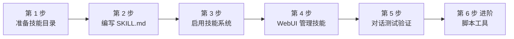

# Skills 接入操作指南

## 指南说明

本指南是一份**从零到一**的完整操作手册：手把手带你创建第一个技能、启用技能系统、在 WebUI 中管理技能，并通过对话验证技能生效。整个过程约 10 分钟。

读完本指南你将掌握：

- 技能目录的结构与 `SKILL.md` 编写方法
- 如何通过配置文件与 WebUI 启用/停用技能
- 如何让技能在对话中触发并正确工作
- （进阶）如何为技能附带脚本工具

## 前置条件

开始之前，请确认：

| 条件             | 说明                                      |
| ---------------- | ----------------------------------------- |
| AmritaBot 已启动 | 机器人正常运行，可正常对话                |
| 已登录 WebUI     | 需要管理员权限访问 `聊天管理` 页面        |
| 聊天功能已启用   | 默认开启；若曾关闭，请先在群聊/私聊中恢复 |

## 操作流程总览



| 步骤            | 内容            | 产出                           |
| --------------- | --------------- | ------------------------------ |
| 第 1 步         | 准备技能目录    | `config/chat/skills/` 目录就绪 |
| 第 2 步         | 编写 `SKILL.md` | 一个可用的技能（翻译助手）     |
| 第 3 步         | 启用技能系统    | `[skills]` 配置生效            |
| 第 4 步         | WebUI 管理技能  | 图形化启停、重载、校验         |
| 第 5 步         | 对话测试        | 技能被模型调用并返回结果       |
| 第 6 步（进阶） | 脚本工具        | 技能附带可执行脚本             |

---

## 第 1 步：准备技能目录

技能目录与模型预设目录（`config/chat/models/`）同级，即 `config/chat/skills/`。

首次启动时若目录不存在，Amrita 会自动创建；你也可以手动创建：

```bash
mkdir -p config/chat/skills
```

一个技能就是一个子目录，目录名建议与技能用途一致（例如 `translate`、`summarize`）：

```text
config/chat/skills/
├── translate/        # 技能一：翻译
│   └── SKILL.md
└── summarize/        # 技能二：摘要
    ├── SKILL.md
    └── scripts/      # 可选：技能附带的脚本工具
```

> **提示**：目录里暂时没有技能也不影响机器人运行，技能列表为空时系统会自动跳过技能系统。

## 第 2 步：编写你的第一个技能

以"翻译助手"为例，完整创建一个技能。

### 2.1 创建技能目录

```bash
mkdir -p config/chat/skills/translate
```

### 2.2 编写 SKILL.md

在 `config/chat/skills/translate/SKILL.md` 中写入以下内容：

```markdown
---
name: translate
description: 将用户提供的文本翻译成指定语言。当用户请求翻译、转译或询问外文含义时使用。
version: 1.0.0
---

You are a professional translator. Translate the following text
into the language the user specifies.

User request:
$ARGUMENTS

Reply with the translation only, no extra commentary.
```

### 2.3 理解 SKILL.md 的组成

`SKILL.md` 由两部分组成：**YAML frontmatter（元信息）** 与 **正文（指令模板）**。

**frontmatter 字段：**

| 字段          | 必填 | 说明                                             |
| ------------- | ---- | ------------------------------------------------ |
| `name`        | ✅   | 技能唯一标识，用于注册为工具名称，须为合法标识符 |
| `description` | ✅   | 技能用途描述，模型据此判断**何时调用**该技能     |
| `version`     | 可选 | 技能版本号                                       |

**正文与 `$ARGUMENTS`：**

正文是技能的核心指令。调用时，**用户请求的原文**会替换 `$ARGUMENTS` 占位符注入模板，模型据此生成完成任务的具体步骤。

> **编写 `description` 的关键**：不仅要说明技能"能做什么"，还要说明"何时使用"（例如"当用户请求翻译时使用"）。`description` 越精确，模型越能准确判断触发时机，减少误调用。
> **语言约定**：正文指令用什么语言都可以，只要模型能理解。由于系统提示通常为英文，示例使用英文书写。

## 第 3 步：启用技能系统

编辑聊天模块配置文件 `config/chat/config.toml`，添加 `[skills]` 配置段：

```toml
[skills]
# 技能系统总开关
enable = true
# 启用的技能名称列表：空列表 = 全部启用；非空 = 仅列表内的技能启用
selected = []
```

| 配置项     | 默认值 | 说明                                                     |
| ---------- | ------ | -------------------------------------------------------- |
| `enable`   | `true` | 技能系统总开关；`false` 时所有技能不注册、不写入使用指引 |
| `selected` | `[]`   | 白名单：空列表 = 全部启用；非空 = 仅列表内的技能启用     |

保存后**重启机器人**（或直接使用第 4 步 WebUI 的 `重新加载` 让改动生效）。

## 第 4 步：在 WebUI 中管理技能

WebUI 提供图形化技能管理，无需手工编辑配置文件。

1. 登录 Amrita WebUI；
2. 导航到 `聊天管理` -> `技能`；
3. 页面展示已发现的全部技能列表，每项包含：名称、描述、版本、路径、启用状态（Switch）、校验状态（`ok` / `error`）；
4. **行内开关**：勾选/取消勾选单个技能，即时启停（等价于修改 `selected` 名单）；
5. **全部启用** 按钮：清空启用名单（`selected = []`），使目录下所有技能生效；
6. **重新加载** 按钮：重新扫描技能目录，拾取新增/修改的 `SKILL.md`；
7. 若某个技能校验失败，列表对应项会显示 `error` 原因，可按第 7 节排查。

::: tip
WebUI 保存的正是 `[skills]` 配置段（`enable` / `selected`），与直接编辑 `config/chat/config.toml` 完全等效，二者可随时互相切换使用。
:::

## 第 5 步：对话测试验证

技能启用后不需要手动触发：技能会作为工具注册进 Agent 的会话工具池，由模型根据用户请求与技能 `description` 的匹配度决定是否调用。

### 测试方法

向机器人发送一句触发请求，例如：

```text
帮我把 "Hello, world" 翻译成中文
```

### 预期结果

1. 聊天消息中出现 **"使用了技能：translate"** 通知；
2. 机器人随后返回翻译结果。

### 验证清单

- ✅ 出现技能触发通知 → 技能已被模型调用；
- ✅ 返回翻译结果 → 技能模板执行成功；
- ❌ 未触发 → 检查第 7 节"故障排除"。

### 关闭触发通知（可选）

技能被调用时的"使用了技能：xxx"通知，由 `[meta]` 配置段的 `skill_trigger` 控制：

```toml
[meta]
# 技能触发通知（使用了xxx技能），默认开启
skill_trigger = true
```

设为 `false` 即可关闭该通知，技能功能不受影响。

## 第 6 步（进阶）：为技能添加脚本工具

技能除了指令模板，还可以附带**脚本工具**（`scripts/` 目录）。脚本可执行更复杂的操作（如调用外部 API、处理文件）。

### 目录结构

```text
config/chat/skills/my-skill/
├── SKILL.md
└── scripts/
    └── fetch_data.py
```

### 工作机制：渐进披露（Progressive Disclosure）

技能工具采用"按需激活"策略：

1. **初始阶段**：会话工具池仅注册技能入口工具（单参数 `arguments`，参数为用户请求原文）；
2. **技能被调用后**：其附带的脚本工具（`scripts/`）才注入同一会话工具池，供后续调用使用。

这样既避免工具池过早膨胀（工具越多越容易干扰模型选择），也让脚本工具在真正需要时才暴露给模型。同时，技能工具基于全局工具池**克隆**（copy+mixin）注册，不会污染全局单例，与其他工具共存无冲突。

## 完成检查清单

| 检查项                                                  | 状态 |
| ------------------------------------------------------- | ---- |
| `config/chat/skills/` 目录存在，技能子目录含 `SKILL.md` | ☐    |
| `SKILL.md` 含 `name` / `description`（`version` 可选）  | ☐    |
| `config.toml` 中 `[skills] enable = true`               | ☐    |
| WebUI `聊天管理` -> `技能` 能看到技能且校验 `ok`        | ☐    |
| 对话触发技能，出现"使用了技能"通知并返回结果            | ☐    |

## 故障排除

| 现象                                    | 可能原因与解决办法                                    |
| --------------------------------------- | ----------------------------------------------------- |
| 技能页显示"没有发现技能"                | `config/chat/skills/` 下没有 `SKILL.md`，请先放入技能 |
| 技能列表存在但模型不调用                | `description` 不精确；或技能未启用（检查 `selected`） |
| 修改 `SKILL.md` 后不生效                | 在 WebUI 点击 `重新加载`，或重启机器人                |
| 单技能校验失败（`ok: false` / `error`） | `SKILL.md` frontmatter 或正文解析失败，查看机器人日志 |
| 技能触发通知不显示                      | 检查 `[meta]` 段的 `skill_trigger` 是否为 `true`      |
| 模型频繁误调用技能                      | 收窄 `description` 的使用场景，或用 `selected` 白名单 |

## 总结

至此，你已经完成了从"创建技能"到"对话使用"的完整流程。回顾一下关键要点：

- 技能 = 目录 + `SKILL.md`（frontmatter 声明元信息 + 正文指令模板，`$ARGUMENTS` 注入用户请求原文）；
- 启停控制：`[skills]` 配置（`enable` / `selected`）或 WebUI `聊天管理` -> `技能` 二选一；
- 触发方式：模型自动判断，无需手动触发；`meta.skill_trigger` 控制触发通知；
- 脚本工具：`scripts/` 目录 + 渐进披露，按需注入、不污染全局工具池。

把高频、可复用的任务封装为技能，可以让你的机器人以更清晰、更可控的方式完成复杂工作。
