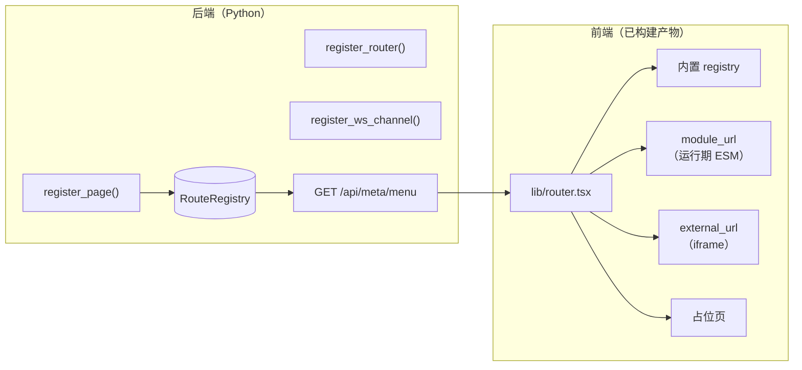

# 页面扩展开发

Amrita 的 WebUI 是**前端 SPA**（React + Tailwind，位于 `frontend/` 目录），
后端只负责菜单/路由元数据与 JSON 数据 API，不渲染服务端模板。

本文档介绍第三方插件如何接入 WebUI —— 包括**不重新构建前端**的方式。

::: tip 相关阅读

- [前端 API](./frontend-api) —— REST 接口与 WebSocket 协议
- [UI 组件库](./components) —— 前端组件结构
- [扩展点与事件钩子](../../developer/extension-points#webui-扩展) —— 后端扩展点总览

:::

## 架构概览



后端 `register_page()` 注册元数据 → `GET /api/meta/menu` 返回 →
前端 `lib/router.tsx` 按顺序解析出组件。

## 三种页面来源

前端按以下顺序解析页面组件：

| 优先级 | 来源 | 需要重新构建前端？ | 说明 |
| --- | --- | --- | --- |
| 1 | 前端内置 `registry` | 是 | Amrita 自带页面（`frontend/src/pages/registry.tsx`） |
| 2 | `module_url` | **否** | 运行期 `import()` 的 ESM 模块，取 `default` 作为组件 |
| 3 | `external_url` | **否** | `<iframe>` 嵌入的独立页面 |
| 4 | 都没有 | — | 渲染「页面未接入」占位页 |

**第三方插件只要提供 `module_url` 或 `external_url`，就无需重新构建前端。**

## 注册页面

```python
from amrita.plugins.webui.API import register_page

register_page(
    "/myplugin/dashboard",  # 路径模式（FastAPI 风格，支持 {param}）
    "我的面板",  # 页面名（显示在侧边栏）
    category="我的插件",  # 分类；__HIDDEN__ 表示不进侧边栏
    icon="activity",  # lucide 图标名
    external_url="/myplugin/page",
)
```

也可以用装饰器形式（`on_page`），但页面渲染由 JSON API 承担，
被装饰的函数体不会执行，保留它只是为了让页面声明贴近原来的写法：

```python
from amrita.plugins.webui.API import on_page


@on_page("/myplugin/dashboard", "我的面板", category="我的插件")
def _page() -> None:
    pass
```

::: warning 必须在插件 import 期注册

页面元数据要在插件加载时登记完毕。若在 `driver.on_startup` 之后才注册，
`/api/meta/menu` 已经可能被前端拉取过，菜单不会出现。

:::

## 方式一：iframe 页面

用任意技术栈写一个独立页面，由插件自己的路由提供 HTML：

```python
from fastapi import APIRouter
from fastapi.responses import HTMLResponse
from amrita.plugins.webui.API import register_page, register_router

router = APIRouter()


@router.get("/page")
async def page() -> HTMLResponse:
    return HTMLResponse("<h1>Hello from my plugin</h1>")


register_router(router, prefix="/myplugin", tags=["myplugin"])
register_page("/myplugin/dashboard", "我的面板", external_url="/myplugin/page")
```

**优点**：技术栈自由（Vue / Svelte / 纯 HTML 都行）、样式与宿主天然隔离、无需构建集成。

**注意**：

- 无法直接复用宿主的 React 组件与 Tailwind 主题
- 登录态不会自动共享（iframe 内的请求同样会被登录中间件拦截，
  需要时用 `postMessage` 从宿主传递一次性 token）

## 方式二：运行期 ESM 模块（原生 UI）

模块需 `export default` 一个 React 组件：

```tsx
const { React } = window.__AMRITA_HOST__!;

export default function Page() {
  const [n, setN] = React.useState(0);
  return React.createElement("button", { onClick: () => setN(n + 1) }, `点击 ${n}`);
}
```

宿主通过 `window.__AMRITA_HOST__` 暴露运行时依赖：

| 键 | 值 |
| --- | --- |
| `React` | React 运行时 |
| `ReactDOM` | react-dom |
| `ReactDOMClient` | react-dom/client |
| `ReactRouterDOM` | react-router-dom |

::: warning 必须把 React 设为 external

插件构建时要把 `react` / `react-dom` / `react-router-dom` 标记为 external，
并从上表取用宿主的实例。否则会打包出**第二份 React**，
导致 hooks 报错、context 失效等难以排查的问题。

:::

**优点**：原生 UI，可直接使用宿主组件与 Tailwind 类，体验与内置页面一致。

**注意**：模块加载失败只影响当前页面（前端有错误边界兜住），不会拖垮整个 WebUI。

## 挂载数据接口

```python
from fastapi import APIRouter
from amrita.plugins.webui.API import register_router

router = APIRouter()


@router.get("/stats")
async def stats() -> dict[str, int]:
    return {"count": 1}


register_router(router, prefix="/api/myplugin", tags=["myplugin"])
```

::: warning 必须在插件 import 期调用

SPA 的 catch-all 路由（`/{full_path:path}`）挂在 `driver.on_startup`，
**晚于它注册的路由会被抢先匹配**，永远返回 `index.html`。

:::

路由受 WebUI 登录中间件保护：

- `/api` 前缀：未登录返回 401 JSON
- 其他前缀：未登录 302 到登录页

## 推送实时数据

```python
from amrita.plugins.webui.API import broadcast_ws, register_ws_channel


async def snapshot() -> dict:
    return {"channel": "myplugin", "data": {"ready": True}}


# snapshot 可为同步或异步；返回 None 表示本次无快照
register_ws_channel("myplugin", snapshot)
await broadcast_ws("myplugin", {"ready": False})
```

客户端订阅：

```json
{ "action": "subscribe", "channels": ["myplugin"] }
```

未声明的频道名会被 `/amrita/ui/ws` 忽略。内置频道为 `system`、`bot`、`logs`。

## 完整示例

一个同时提供页面、接口与实时推送的插件：

```python
from fastapi import APIRouter
from amrita.plugins.webui.API import (
    broadcast_ws,
    register_page,
    register_router,
    register_ws_channel,
)

router = APIRouter()


@router.get("/stats")
async def stats() -> dict[str, int]:
    return {"count": 42}


@router.get("/page")
async def page() -> dict[str, str]:
    return {"hello": "world"}


async def snapshot() -> dict:
    return {"channel": "myplugin", "data": {"ready": True}}


def setup() -> None:
    register_router(router, prefix="/api/myplugin", tags=["myplugin"])
    register_ws_channel("myplugin", snapshot)
    register_page(
        "/myplugin/dashboard",
        "我的面板",
        category="我的插件",
        icon="activity",
        external_url="/api/myplugin/page",
    )
```

## 前端开发（修改 Amrita 自带页面）

只有改动 Amrita 内置页面时才需要：

```bash
cd frontend
bun install
bun run dev      # 开发服务器
bun run build    # 构建产物输出到 amrita/plugins/webui/service/static/
```

新增内置页面需要在 `frontend/src/pages/registry.tsx` 登记
（`路由模式 -> 懒加载组件`），并在后端 `route/menu.py` 的 `_CORE_ROUTES` 中补上菜单项。

## 已知限制

- **前端无运行时扩展**：`registry.tsx` 是编译期常量表，
  `module_url` / `external_url` 是绕过它的两种方式；无法动态注册前端组件
- **WebSocket 频道需预先声明**，且没有频道级的权限控制
  （所有频道对已登录用户可见）
